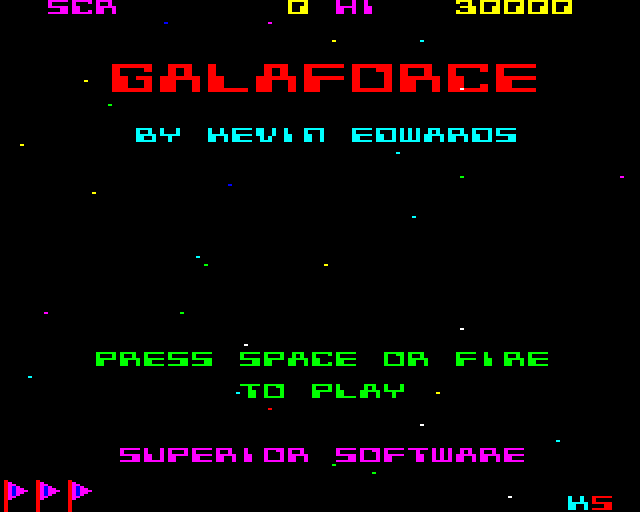

# Galaforce ( BBC Micro )

**Version V1.00**

(c) Kevin Edwards 1985-2019

In 1985 I began writing a shoot-em-up game for the BBC Micro and Electron home computers. This game was published by Superior Software in 1986 under the name Galaforce.

The game is written entirely in 6502 assembly language. The target computers had only 32K bytes of RAM. Of which 20K bytes was required for the video memory ( BBC Micro ) and 10K bytes on the Electron.

Over 30 years have passed and I have decided to preserve this code for the future by making it public.

Originally, the BBC BASIC in-line assembler was used to build the code. However, I decided to make the codebase assemble using 'beebasm' on a PC. This required me to re-work the original source code. This involved de-tokenizing all of the BBC BASIC files and adapting the code to use beebasm friendly directives / commands. This now allows Visual Code or other IDEs to be used to build the code in a nice development environment.

The code here is for the BBC Micro version of the game. I had slightly different code for the Electron and Master 128 versions. I hope to make these available in the future when I get more spare time.

I hope it is useful to people who have an interest in 6502 assembly language programming and to those who wish to know how games were made in the 1980s.

# Build Tools required ( PC )

To build the game you first need to install the following tools:-

* [beebasm](https://github.com/stardot/beebasm)

# Build Steps ( PC )

Run 'make.bat' from a command prompt whilst in the project's root folder. This will assemble the code and output 'Galaforce1BBC.ssd' in the same folder. This disk image file can be loaded by many different BBC Micro Emulators, including B-em and BeebEm.

Alternatively, you could use 'Visual Studio Code' with the 'Beeb VSC' extension. I hope to include the required workspace and .json files required to do this.

# Additional Notes

You can find me on Twitter @KevEdwardsRetro where I ramble on about all kinds of retro computer and video game things. Please drop by and say hello.

Many thanks to Rich Talbot-Watkins for his great work on BeebAsm.

Thank you for reading this far.
